# C_Library Data Structure and its algorithm used in DSA course in BITS and in Competitive Programming

The coded solution for 2,4,5,8,9 were submitted for the partial fulfillment of course completion of DSA CS F211 at BITS Pilani, Pilani campus. The project can be used as a library in C/C++ for the implementation and proofs regarding the time and space of various algorithms and data structures. 

## Objectives of the project:-

* The main objective of 1,5,6,7 is to learn the working between pointers and memory to implement non -linear data structure such as linked list, trees.
* The objective of 8 and 9 is to compare the time and space of the comparison based sorting methods.
* 2 was done to replicate the scheduler algorithm data structure in the CPU using priority queues.
* 3 is an application of stack data structre.
* 4 was implemented to provide a proof that a larger tableSize corresponds to a lower collison count. The proof is computational in nature.

**1. [Linked List](Linked%20List)**
  * [X] Single Linked List with utilities
  * 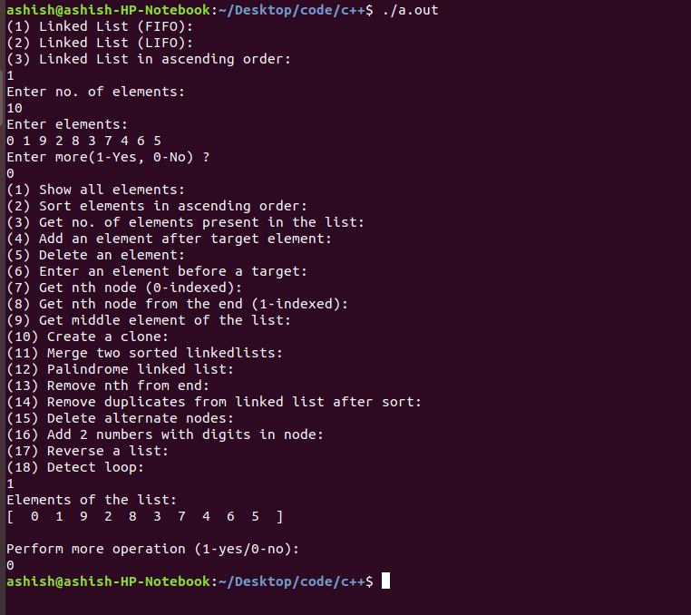
  * [X] Polynomial algebra using Linked Lists
  * 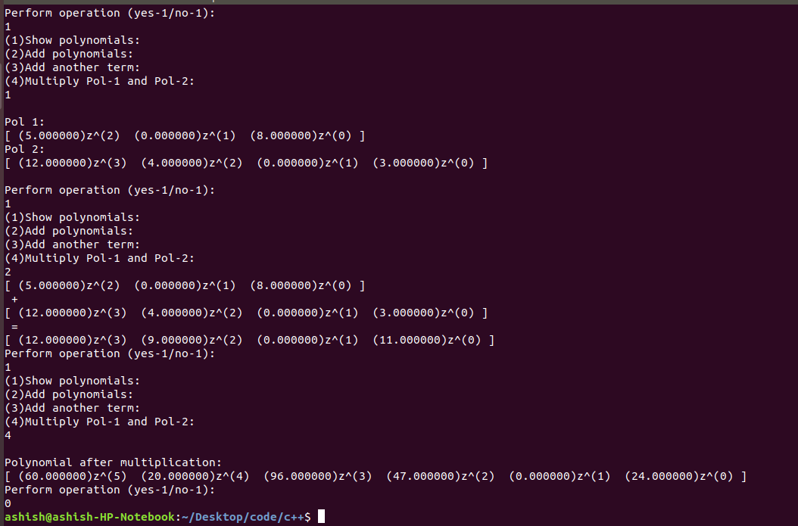
  * [X] Circular Linked List
  * [X] Doubly Linked List

**2. [Multi Queue](Multi%20Queue)**
  * [X] Multi Queue data structure implementation
  * Loading the queue: 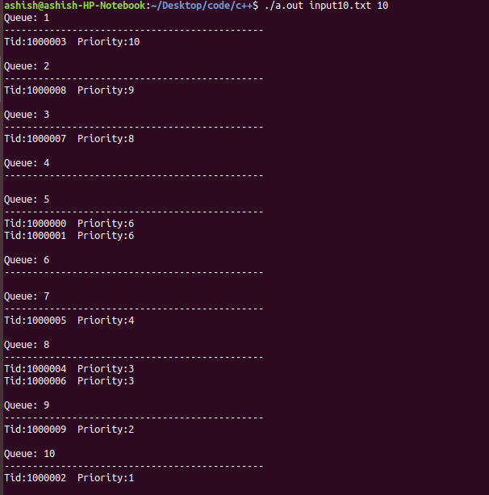
  * Deleting items from queue: 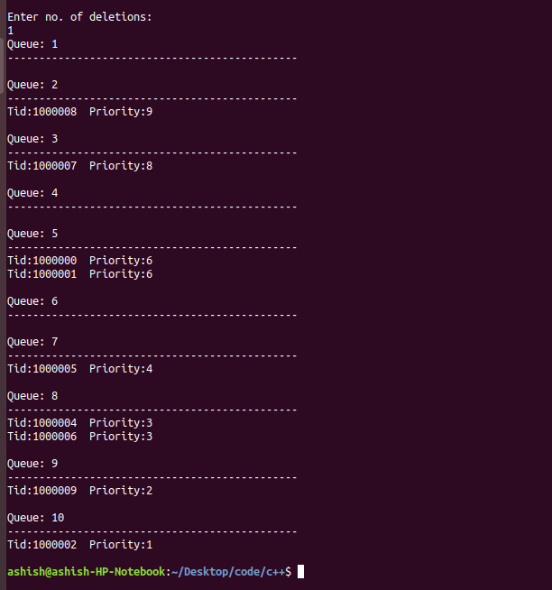
  
**4. [Huffman-coding](Huffman%20-%20Coding)**
 * [X] Implemeent an algorithm to generate huffman codes for all characters in string.
 * [X] Generate level order traversal of Huffman tree.
 * [X] Encode the string with huffman code.
 * [ ] Generate a decoder function to decode the encoded string
 * 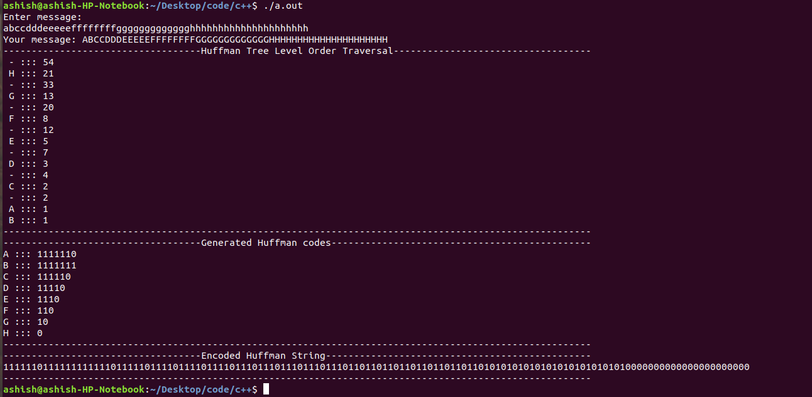
 
**3. [Hash function relation on tableSize and baseNumber](Best%20Hash%20Function)**
 * [X] Implement parser,hash function and profiler to compare the best values of baseNumber and tableSize for linear hash depending on tableSize and baseNumber.
 * [ ] Implement a hash table.
 * 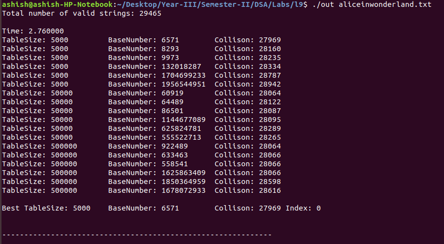
 * 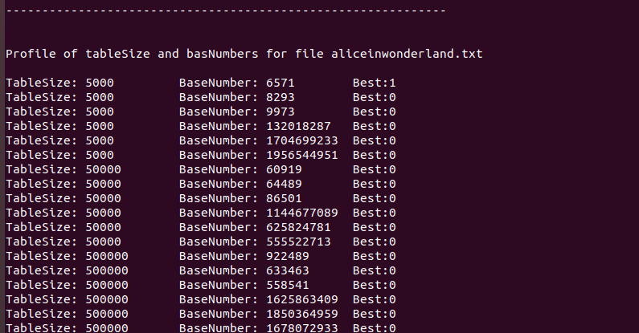
 
**4. [RB Tree Implementation](RB%20Tree%20implementation)**
  * [X] Implement self balancing binary tree RB Tree.
 
**5. [BST implementation](BST%20implementation)**
  * [X] BST implementation with functionality-
    * [X] Invert tree
    * [X] Inorder successor
  * 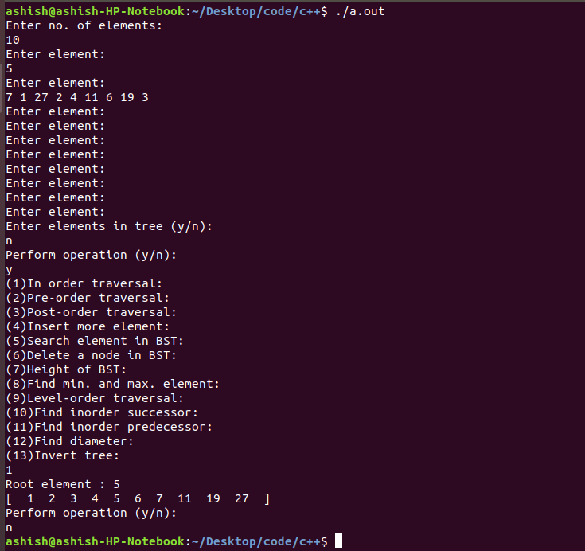
  
**6. [Heap data structure](Heap%20data%20structure)**
  * [X] Min-Heap imlementation
  * 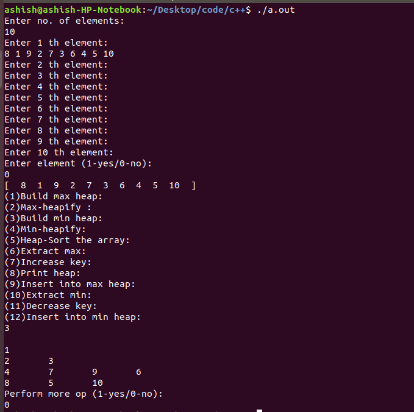
  * [X] Max-heap implementation
  * 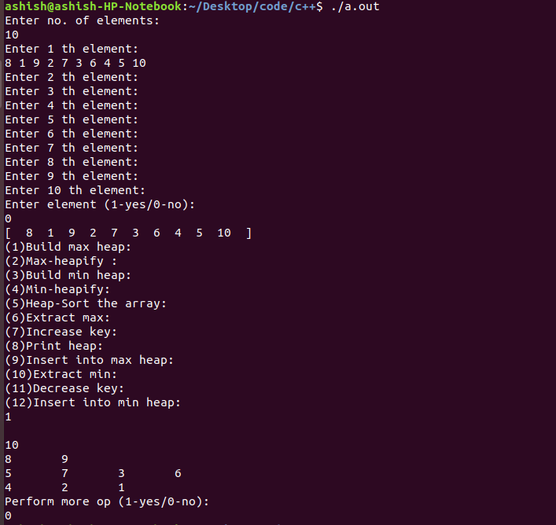
  * [X] Heap sort
  * 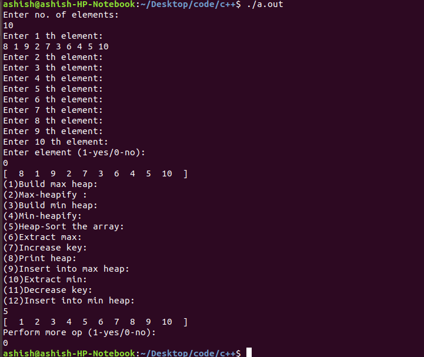
  
**7. [Recursion v/s Iteration (time and space)](Rec%20vs%20Iter%20Merge%20Sort%20(Time%20&%20Space))**
  * [X] Implementation of recursive and iterative merge sort and comparison between the amount of time and space b/w the 2 algorithm
  * Conclusion: Iterative and Recursive merge sort have similar time complexity. But, iterative has O(1) space complexity compared to O(n) for recursive procedure.
  * 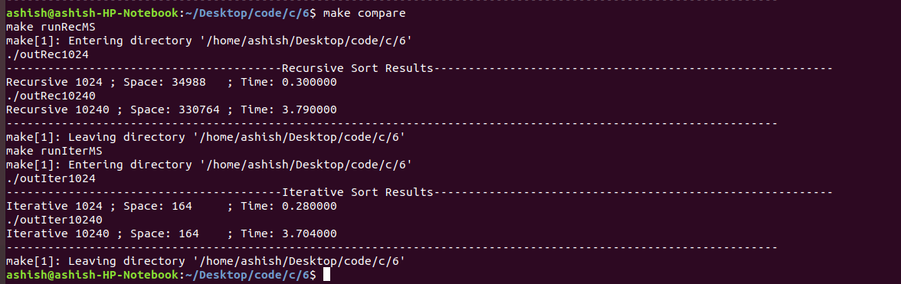

**8. [Insertion sort on satellite data](Insertion%20sort%20satellite%20data)**
  * [X] Perform insertion sort on Employee records
  
**9. [Stack implementaion and application](Stack+Application)**
  * [X] Stack data structure implementation using Linked List
  * [X] Stack Application to solve Infix/Prefix/Postfix expressions and convert Pre/Post fix expression to Infix
  * 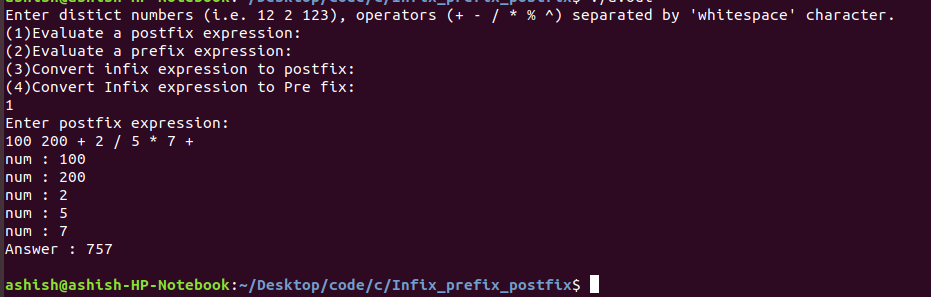
  * 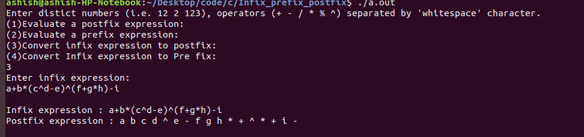
  
## Built using
1. g++ compiler
2. vim text editor
3. gcc compiler
4. makefile
